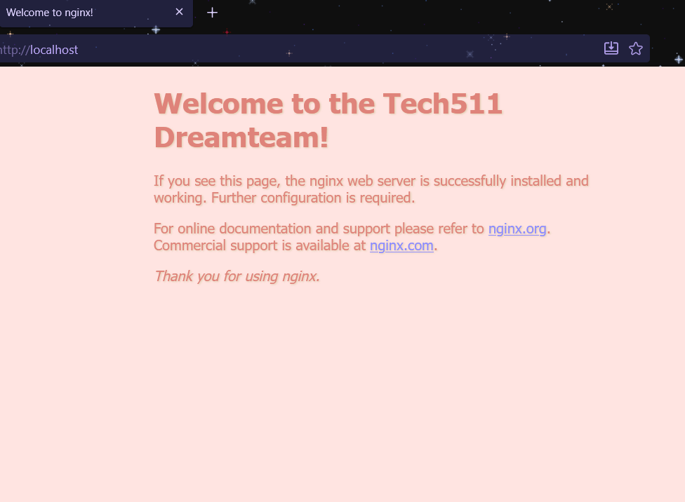
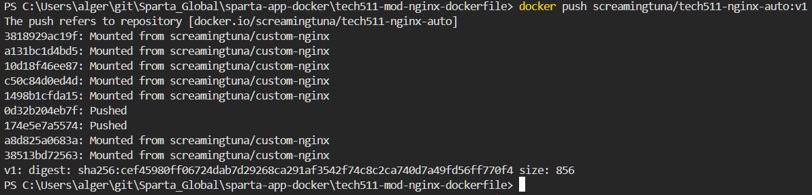
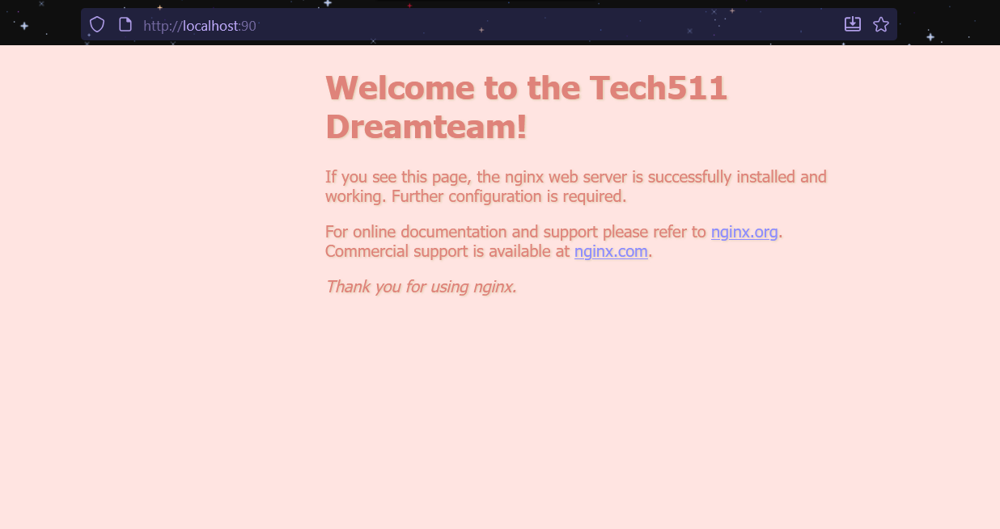
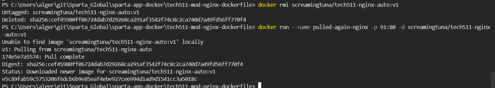
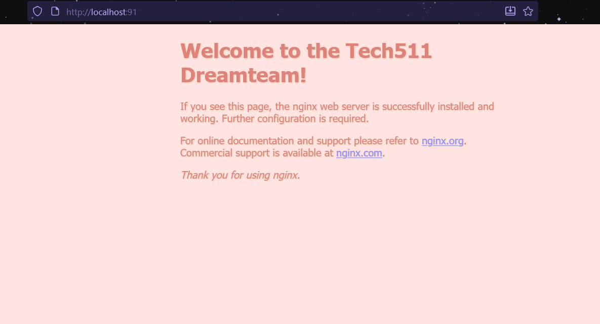
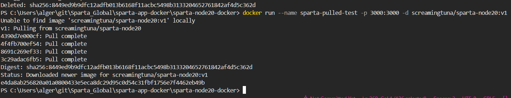
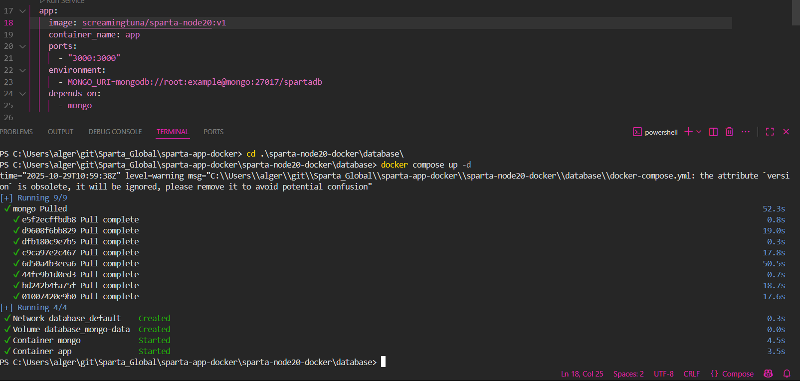

# Introduction to Docker and containerisation
- [Introduction to Docker and containerisation](#introduction-to-docker-and-containerisation)
  - [Differences between virtualisation and containerisation](#differences-between-virtualisation-and-containerisation)
    - [What is usually included in a container vs virtual machine?](#what-is-usually-included-in-a-container-vs-virtual-machine)
    - [Benefits of each, especially a virtual machine over the traditional architecture](#benefits-of-each-especially-a-virtual-machine-over-the-traditional-architecture)
  - [Microservices](#microservices)
  - [Docker](#docker)
  - [Getting started with Docker](#getting-started-with-docker)
    - [Learn to manage Docker containers locally](#learn-to-manage-docker-containers-locally)
      - [Task: Run and pull your first image](#task-run-and-pull-your-first-image)
      - [Task: Run nginx web server in a Docker container](#task-run-nginx-web-server-in-a-docker-container)
      - [Task: Remove a container](#task-remove-a-container)
      - [Task: Modify our nginx default page in our running container](#task-modify-our-nginx-default-page-in-our-running-container)
      - [Task: Run different container on different port](#task-run-different-container-on-different-port)
      - [Push host-custom-static-webpage container image to Docker Hub](#push-host-custom-static-webpage-container-image-to-docker-hub)
      - [Automate Docker Image Creation with a Dockerfile](#automate-docker-image-creation-with-a-dockerfile)
  - [Run Sparta Test App in a Container](#run-sparta-test-app-in-a-container)
  - [Docker Compose](#docker-compose)
    - [Task: Research Docker Compose](#task-research-docker-compose)
    - [Why Use Docker Compose?](#why-use-docker-compose)
    - [How to Use Docker Compose](#how-to-use-docker-compose)
      - [What Do You Need to Install?](#what-do-you-need-to-install)
      - [How to Store Your Docker Compose File](#how-to-store-your-docker-compose-file)
    - [Docker Compose Commands](#docker-compose-commands)
      - [Manage Your Application](#manage-your-application)
      - [Start the Application (Without Detached Mode)](#start-the-application-without-detached-mode)
      - [Start the Application (In Detached Mode)](#start-the-application-in-detached-mode)
      - [Difference Between Detached and Non-Detached Mode](#difference-between-detached-and-non-detached-mode)
      - [Stop the Application](#stop-the-application)
      - [Run Your Application in Detached Mode](#run-your-application-in-detached-mode)
      - [Check Services Running with Docker Compose](#check-services-running-with-docker-compose)
      - [View Logs in Real-Time](#view-logs-in-real-time)
    - [View Docker Compose Images](#view-docker-compose-images)
    - [Further Reading](#further-reading)
  - [Task: Use Docker Compose to run app and database containers](#task-use-docker-compose-to-run-app-and-database-containers)

## Differences between virtualisation and containerisation 
- **Virtualisation** uses a hypervisor to emulate entire machines, each with its own OS.
- **Containerisation** runs isolated applications sharing the host OS kernel, making them lightweight and faster to start.

### What is usually included in a container vs virtual machine?
- What’s Included:
  - VM: Guest OS, binaries, libraries, and the application.
  - Container: App code, dependencies, runtime, and config—but no OS.

### Benefits of each, especially a virtual machine over the traditional architecture 
- Benefits
  - VMs:
    - Strong isolation and security.
    - Can run different OS types on one host.
    - Ideal for legacy systems and full-stack environments.
  - Containers:
    - Faster deployment and scaling.
    - Efficient resource usage.
    - Perfect for microservices and cloud-native apps.

## Microservices
**What Are They?**

Microservices are small, independent services that each handle a specific business function. They communicate via APIs and can be developed, deployed, and scaled independently.

**How Are They Made Possible?**

- Containerisation (e.g., Docker)
- API gateways and service meshes
- CI/CD pipelines
- Cloud platforms and orchestration tools (e.g., Kubernetes).

**Benefits**

- Scalability: Scale services independently.
- Resilience: Faults in one service don’t crash the whole app.
- Agility: Faster development and deployment.
- Tech flexibility: Use different languages or frameworks per service.

## Docker
**What Is It?**

Docker is a containerisation platform that packages applications and their dependencies into portable containers. It simplifies deployment across environments.

**Alternatives**

- Podman: Daemonless, rootless containers.
- Containerd: Lightweight runtime used by Kubernetes.
- Buildah: Focused on building OCI-compliant images.
- Rkt, LXC, Rancher Desktop.

**How It Works (Architecture/API)**

- Client: CLI interface (`docker run`, `docker build`).
- Daemon: `dockerd` handles container lifecycle.
- Docker Host: Runs containers and manages resources.
- Registry: Stores and distributes images (e.g., Docker Hub).
- API: RESTful interface for automation and remote control.

Success Story
Ataccama, a data management company, modernised its infrastructure using Docker:
- Migrated from monolithic to containerised architecture.
- Achieved faster deployment, improved scalability, and reduced server count by 40%

## Getting started with Docker
- Needed to install WSL for docker to function
- also needed to enable virtualisation on BIOS for everything to work
- initialised Docker and followed tutorials
- made first container
- Note that it already has a Dockerfile. For your own projects you need to create this yourself.

```bash
docker build -t welcome-to-docker .
```

when checking images folder:


running image:<br>


> <h4>Explanation from Docker: </h4>
> When working with containers, you usually need to create a Dockerfile to define your image and a compose.yaml file to define how to run it.
> To help you create these files, Docker has a command called docker init. Run this command in a project folder, and Docker will create all the required files needed.

### Learn to manage Docker containers locally
#### Task: Run and pull your first image
```
docker run hello-world
```
- Checks if the `hello-world` image exists locally.
- If not, Docker pulls it from Docker Hub.
- Then it creates and runs a container from that image.
- The container prints a welcome message and exits.
- Confirms Docker is installed and working.
- Demonstrates how Docker pulls and runs images.

- ran `docker run hello-world` again
- This time, Docker does not re-download the image.
- It uses the cached image stored locally.
- The container runs instantly and prints the same message.

#### Task: Run nginx web server in a Docker container
```
docker run --name run-nginx -p 80:80 -d nginx
```
- `--name run-nginx` : names the container.
- `p 8080:80` : maps port 80 on your machine to port 80 in the container.
- `-d`	: runs in detached mode.
- 
- use `docker ps` to see what's running:
- 

#### Task: Remove a container
- can either press delete button on desktop client:
- 
- OR:
```bash
docker stop run-nginx
docker rm run-nginx
```
- if you try to remove container that is still running, it is not possible, so you need to force is using `docker rm --force`
- 
#### Task: Modify our nginx default page in our running container
- access exec shell either through deskop interface or through command:
```bash
docker exec -it run-nginx bash
```
- ran `whoami` and noticed I'm root so don't need sudo
- 
- 

#### Task: Run different container on different port 
- Run another Nginx container image with command `docker run --name dream-nginx -p 80:80 -d daraymonsta/nginx-257:dreamteam`
- 
- port 80 is already in use- use a different port to run.
- used port 90 on host to map to port 80 of container:
- 
- checking link:
- 

#### Push host-custom-static-webpage container image to Docker Hub 
- logged in with `docker login`
- command to push running container:
```bash
docker commit <container-name> <username>/custom-nginx:v1
```
- 
- needed to install nano because I couldn't nano the index page on my container:
- 
- After the image was committed, needed to push it with:
```bash
docker push <container-name> <username>/custom-nginx:v1
```
- and then ran it from the docker hub:
```bash
docker run --name dreamteam-nginx -p 80:80 -d <username>/custom-nginx:v1
```
- 

#### Automate Docker Image Creation with a Dockerfile

Instead of manually modifying a running container, can automate the customisation of the Nginx default page using a Dockerfile. This ensures repeatability, version control, and easy sharing via Docker Hub.

- setting up folder:
```
mkdir tech511-mod-nginx-dockerfile
cd tech511-mod-nginx-dockerfile
```
- docker requires a single Dockerfile per build context, and the build context is defined by the folder you run docker build from `docker build`
- creating a dedicated folder ensures:
  - Your Dockerfile and related files (like index.html) are isolated.
  - You avoid conflicts with other Dockerfiles or unrelated files.
  - You can version, test, and reuse this setup cleanly.

- inside the folder, made a custom index.html page
- also made a dockerfile
- ran command:
```bash
docker build -t tech511-nginx-auto:v1 .
```
- `.` indicates to use current directory
- then made a new container:
```bash
docker run --name auto-nginx -p 80:80 -d tech511-nginx-auto:v1
```
- which then shows the custom page from nginx:
- 
- next needed to tag and push the image, so ran
```bash
docker tag tech511-nginx-auto:v1 screamingtuna/tech511-nginx-auto:v1
docker push screamingtuna/tech511-nginx-auto:v1
```
- 
- tested by pulling image using `docker run --name pulled-nginx -p 90:80 -d screamingtuna/tech511-nginx-auto:v1`
- 
- removed image locally with 
```bash
docker rmi tech511-nginx-auto:v1
docker rmi screamingtuna/tech511-nginx-auto:v1
```
- Then tried to make a new container with pushed image with:
```bash
docker run --name pulled-again-nginx -p 91:80 -d screamingtuna/tech511-nginx-auto:v1
```
- 
- 
- Above container re-pulled from Docker Hub to verify deployment.

## Run Sparta Test App in a Container
- Created folder `sparta-node20-docker` for isolated build context.
- Placed `app` folder with frontpage code inside.
- Wrote Dockerfile to automate build using Node.js v20.
- Built image: `docker build -t screamingtuna/sparta-node20:v1 .`
- Ran container on port 3000 and verified frontpage.
```bash
docker run --name sparta-test -p 3000:3000 -d screamingtuna/sparta-node20:v1
```
- 
- Pushed image to Docker Hub with `docker push screamingtuna/sparta-node20:v1`
- Removed local image and re-pulled from Docker Hub to verify deployment.
```bash
docker rm -f sparta-test
docker rmi screamingtuna/sparta-node20:v1
docker run --name sparta-test -p 3000:3000 -d screamingtuna/sparta-node20:v1
```
- 
---

## Docker Compose
### Task: Research Docker Compose 
### Why Use Docker Compose?

Docker Compose is a tool for defining and running multi-container Docker applications. It allows you to manage complex setups (e.g., web server + database + cache) using a single configuration file (`docker-compose.yml`). Key benefits include:

- Simplified multi-container orchestration
- Easy service networking and dependency management
- Reproducible environments for development and testing
- One-command startup and teardown for entire stacks

---

### How to Use Docker Compose

#### What Do You Need to Install?

- **Docker Desktop** (includes Docker Compose by default, which is what we have on windows)
- Or install separately on Linux:
  ```bash
  sudo apt install docker-compose
  ```
- Verify installation:
  ```bash
  docker compose version
  ```

---

#### How to Store Your Docker Compose File

- Save your configuration as `docker-compose.yml` in your project root directory.
- Example structure:
  ```
  my-project/
  ├── app/
  ├── docker-compose.yml
  └── Dockerfile
  ```


### Docker Compose Commands

#### Manage Your Application
```bash
docker compose up
docker compose down
docker compose restart
```

#### Start the Application (Without Detached Mode)
```bash
docker compose up
```
- Runs in the foreground
- Displays logs and output directly in the terminal

#### Start the Application (In Detached Mode)
```bash
docker compose up -d
```
- Runs in the background
- Frees up your terminal for other tasks


#### Difference Between Detached and Non-Detached Mode

| Mode            | Behavior                              |
|-----------------|----------------------------------------|
| Non-detached    | Shows live logs, blocks terminal       |
| Detached (`-d`) | Runs silently in background            |


#### Stop the Application
```bash
docker compose down
```
- Stops and removes containers, networks, and volumes defined in the Compose file

---

#### Run Your Application in Detached Mode
```bash
docker compose up -d
```

#### Check Services Running with Docker Compose
```bash
docker compose ps
```
- Lists active containers defined in your Compose file

#### View Logs in Real-Time
```bash
docker compose logs -f
```
- `-f` follows logs like `tail -f`


### View Docker Compose Images
```bash
docker compose images
```
- Shows image names and tags used by your services


### Further Reading

- [Docker Compose Official Documentation](https://docs.docker.com/compose/)
- [Docker Compose CLI Reference](https://docs.docker.com/compose/reference/)
- [Linux Handbook: Docker Compose Essentials](https://linuxhandbook.com/docker-compose-essential/)
- [GeeksforGeeks: Docker Compose Overview](https://www.geeksforgeeks.org/devops/docker-compose/)
- [DEV Community: Beginner’s Guide to Docker Compose](https://dev.to/haraf/docker-docker-compose-for-beginners-full-guide-real-project-example-b7)

## Task: Use Docker Compose to run app and database containers 
- made a YAML file for docker compose
- ran `docker compose up-d`
- 
- did not get posts though - fix: amended mongodb line
- 
- needed to reseed database
- used `docker exec -it app node seeds/seed.js`
- 
docker exec -it mongo cat /etc/mongod.conf 
