# Introduction to Docker and containerisation
- [Introduction to Docker and containerisation](#introduction-to-docker-and-containerisation)
  - [Differences between virtualisation and containerisation](#differences-between-virtualisation-and-containerisation)
    - [What is usually included in a container vs virtual machine?](#what-is-usually-included-in-a-container-vs-virtual-machine)
    - [Benefits of each, especially a virtual machine over the traditional architecture](#benefits-of-each-especially-a-virtual-machine-over-the-traditional-architecture)
  - [Microservices](#microservices)
  - [Docker](#docker)
  - [Getting started with Docker](#getting-started-with-docker)
    - [Learn to manage Docker containers locally](#learn-to-manage-docker-containers-locally)
      - [Task: Run and pull your first image](#task-run-and-pull-your-first-image)
      - [Task: Run nginx web server in a Docker container](#task-run-nginx-web-server-in-a-docker-container)
      - [Task: Remove a container](#task-remove-a-container)
      - [Task: Modify our nginx default page in our running container](#task-modify-our-nginx-default-page-in-our-running-container)
      - [Task: Run different container on different port](#task-run-different-container-on-different-port)
      - [Push host-custom-static-webpage container image to Docker Hub](#push-host-custom-static-webpage-container-image-to-docker-hub)
      - [Automate Docker Image Creation with a Dockerfile](#automate-docker-image-creation-with-a-dockerfile)

## Differences between virtualisation and containerisation 
- **Virtualisation** uses a hypervisor to emulate entire machines, each with its own OS.
- **Containerisation** runs isolated applications sharing the host OS kernel, making them lightweight and faster to start.

### What is usually included in a container vs virtual machine?
- What’s Included:
  - VM: Guest OS, binaries, libraries, and the application.
  - Container: App code, dependencies, runtime, and config—but no OS.

### Benefits of each, especially a virtual machine over the traditional architecture 
- Benefits
  - VMs:
    - Strong isolation and security.
    - Can run different OS types on one host.
    - Ideal for legacy systems and full-stack environments.
  - Containers:
    - Faster deployment and scaling.
    - Efficient resource usage.
    - Perfect for microservices and cloud-native apps.

## Microservices
📘 What Are They?
Microservices are small, independent services that each handle a specific business function. They communicate via APIs and can be developed, deployed, and scaled independently.
🛠️ How Are They Made Possible?
- Containerisation (e.g., Docker)
- API gateways and service meshes
- CI/CD pipelines
- Cloud platforms and orchestration tools (e.g., Kubernetes).
🌟 Benefits
- Scalability: Scale services independently.
- Resilience: Faults in one service don’t crash the whole app.
- Agility: Faster development and deployment.
- Tech flexibility: Use different languages or frameworks per service.

## Docker
📦 What Is It?
Docker is a containerisation platform that packages applications and their dependencies into portable containers. It simplifies deployment across environments.

Alternatives
- Podman: Daemonless, rootless containers.
- Containerd: Lightweight runtime used by Kubernetes.
- Buildah: Focused on building OCI-compliant images.
- Rkt, LXC, Rancher Desktop.

🧠 How It Works (Architecture/API)
- Client: CLI interface (`docker run`, `docker build`).
- Daemon: `dockerd` handles container lifecycle.
- Docker Host: Runs containers and manages resources.
- Registry: Stores and distributes images (e.g., Docker Hub).
- API: RESTful interface for automation and remote control.

Success Story
Ataccama, a data management company, modernised its infrastructure using Docker:
- Migrated from monolithic to containerised architecture.
- Achieved faster deployment, improved scalability, and reduced server count by 40%

## Getting started with Docker
- Needed to install WSL for docker to function
- also needed to enable virtualisation on BIOS for everything to work
- initialised Docker and followed tutorials
- made first container
- Note that it already has a Dockerfile. For your own projects you need to create this yourself.

```bash
docker build -t welcome-to-docker .
```

when checking images folder:


running image:<br>
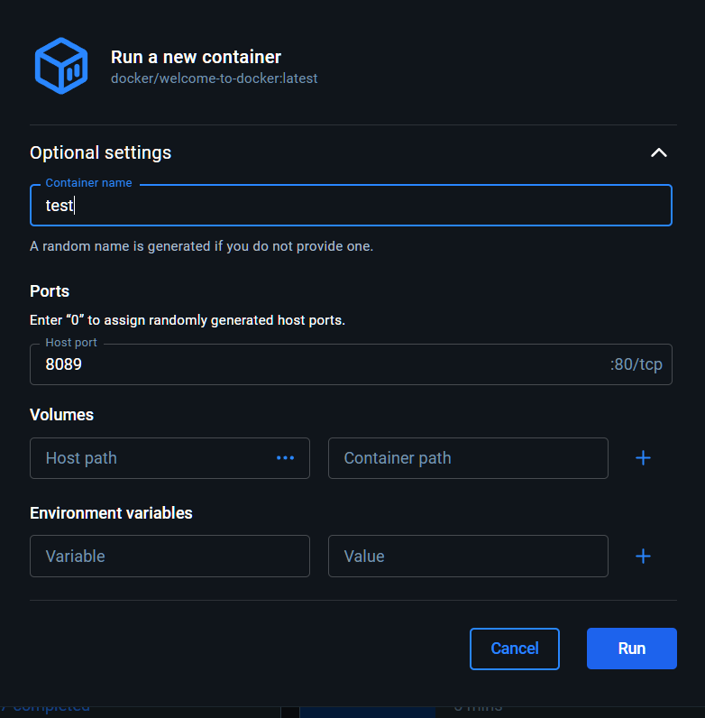

When working with containers, you usually need to create a Dockerfile to define your image and a compose.yaml file to define how to run it.

To help you create these files, Docker has a command called docker init. Run this command in a project folder, and Docker will create all the required files needed. In this guide, you will see how this works.

### Learn to manage Docker containers locally
#### Task: Run and pull your first image

#### Task: Run nginx web server in a Docker container
```
docker run --name run-nginx -p 80:80 -d nginx
```
- `--name run-nginx` : names the container.
- `p 8080:80` : maps port 80 on your machine to port 80 in the container.
- `-d`	: runs in detached mode.
- 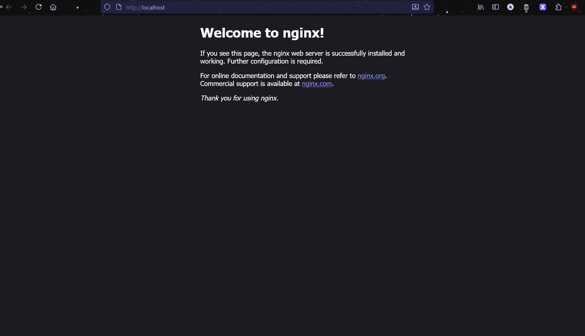
- use `docker ps` to see what's running:
- 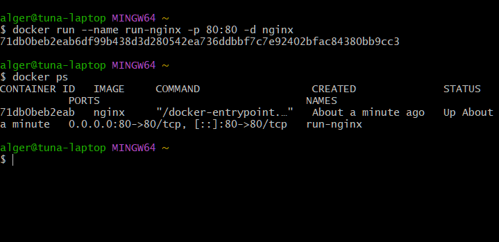

#### Task: Remove a container
- can either press delete button on desktop client:
- 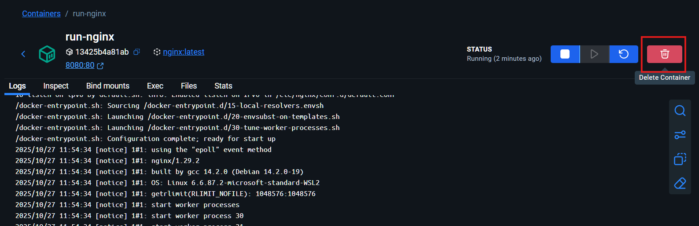
- OR:
```bash
docker stop run-nginx
docker rm run-nginx
```
- if you try to remove container that is still running, it is not possible, so you need to force is using `docker rm --force`
- 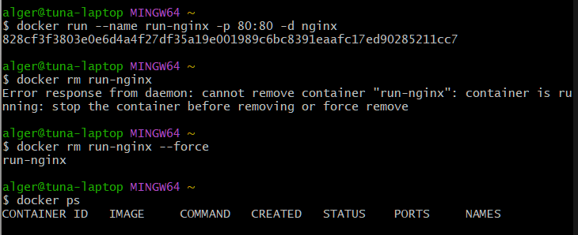
#### Task: Modify our nginx default page in our running container
- access exec shell either through deskop interface or through command:
```bash
docker exec -it run-nginx bash
```
- ran `whoami` and noticed I'm root so don't need sudo
- 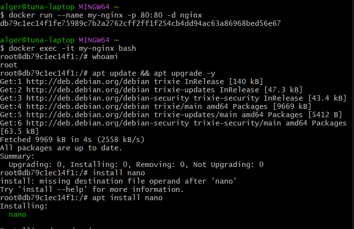
- 

#### Task: Run different container on different port 
- Run another Nginx container image with command `docker run --name dream-nginx -p 80:80 -d daraymonsta/nginx-257:dreamteam`
- 
- port 80 is already in use- use a different port to run.
- used port 90 on host to map to port 80 of container:
- 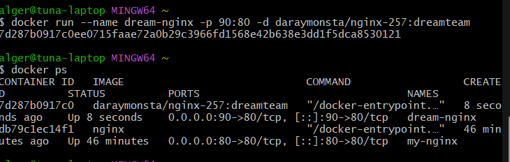
- checking link:
- 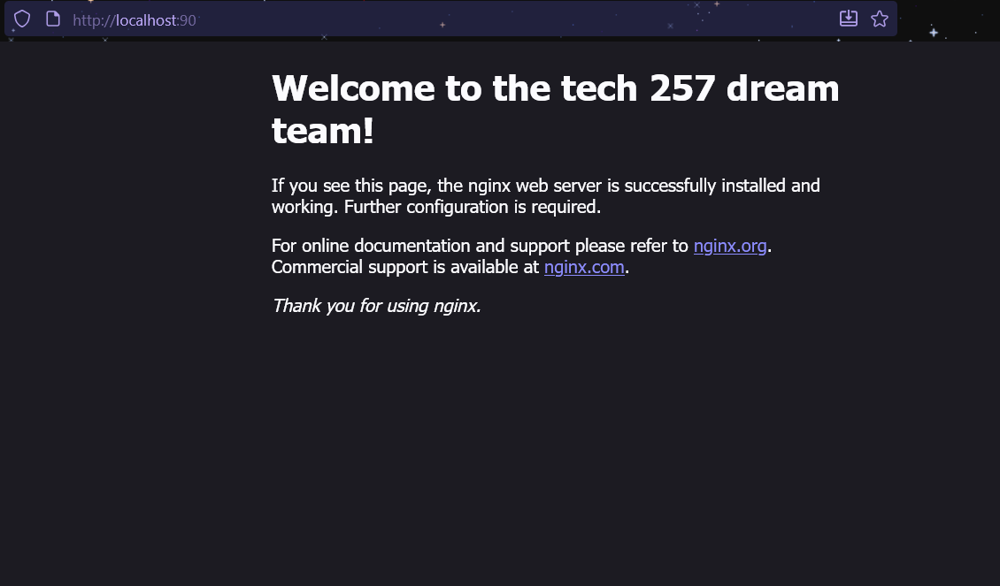

#### Push host-custom-static-webpage container image to Docker Hub 
- logged in with `docker login`
- 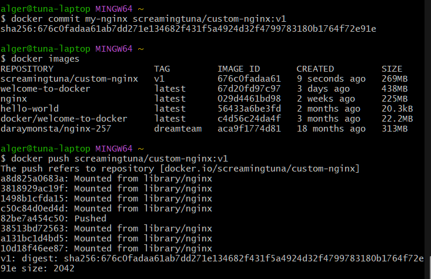
- 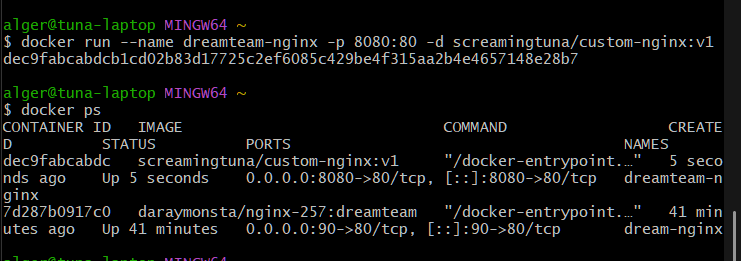
- 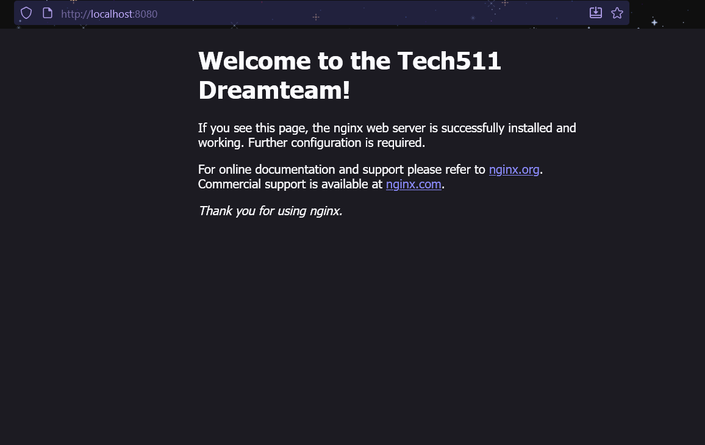


#### Automate Docker Image Creation with a Dockerfile

