# Intro to Kubernetes

- [Intro to Kubernetes](#intro-to-kubernetes)
    - [Why Is Kubernetes Needed](#why-is-kubernetes-needed)
    - [Benefits of Kubernetes](#benefits-of-kubernetes)
    - [Success Stories](#success-stories)
    - [Kubernetes Architecture](#kubernetes-architecture)
    - [Cluster Setup](#cluster-setup)
      - [What Is a Cluster](#what-is-a-cluster)
      - [Master vs Worker Nodes](#master-vs-worker-nodes)
      - [Managed Service vs Self-Hosted](#managed-service-vs-self-hosted)
      - [Control Plane vs Data Plane](#control-plane-vs-data-plane)
    - [Kubernetes Objects](#kubernetes-objects)
      - [Common Objects](#common-objects)
      - [What Does "Ephemeral Pod" Mean](#what-does-ephemeral-pod-mean)
    - [Mitigating Container Security Concerns](#mitigating-container-security-concerns)
    - [Maintained Images](#maintained-images)
      - [What Are They](#what-are-they)
      - [Pros and Cons](#pros-and-cons)
  - [Task: Get Kubernetes to run on desktop](#task-get-kubernetes-to-run-on-desktop)
  - [Task: Create Nginx deployment only](#task-create-nginx-deployment-only)
    - [Commands used:](#commands-used)
    - [Access Notes](#access-notes)
  - [Task: Get NodePort service running:](#task-get-nodeport-service-running)
    - [Commands](#commands)
    - [Task: See what happens when we delete a pod](#task-see-what-happens-when-we-delete-a-pod)
  - [Task: Increase replicas with no downtime](#task-increase-replicas-with-no-downtime)
  - [Task: Delete K8s deployments and services](#task-delete-k8s-deployments-and-services)
  - [Task: K8s deployment of NodeJS Sparta test app](#task-k8s-deployment-of-nodejs-sparta-test-app)

---

### Why Is Kubernetes Needed

Kubernetes solves the complexity of managing containers in production environments. Containers are lightweight and portable, but without orchestration, they become hard to manage at scale. Kubernetes provides:

- **Automated deployment and scaling**
- **Self-healing capabilities** (e.g., restarting failed containers)
- **Load balancing and service discovery**
- **Declarative configuration and infrastructure as code**

It enables consistent environments across dev, test, and production.

### Benefits of Kubernetes

- **Cost efficiency**: Optimizes resource usage and reduces infrastructure costs
- **Portability**: Runs across on-premises, cloud, and hybrid environments
- **High availability**: Ensures uptime through replication and failover
- **DevOps acceleration**: Supports CI/CD pipelines and microservices architecture
- **Vendor neutrality**: Avoids cloud lock-in by supporting multi-cloud deployments

### Success Stories

- **Spotify**: Migrated to Kubernetes for better scalability and developer autonomy
- **Airbnb**: Uses Kubernetes to manage microservices and improve deployment speed
- **CERN**: Runs thousands of containers for scientific workloads
- **Box**: Improved infrastructure efficiency and reduced downtime

### Kubernetes Architecture

Kubernetes follows a master-worker architecture:

```
+---------------------+        +---------------------+
|     Control Plane   |        |     Worker Node     |
|---------------------|        |---------------------|
| API Server          |        | Kubelet             |
| Scheduler           |        | Container Runtime   |
| Controller Manager  |        | Kube Proxy          |
| etcd (key-value DB) |        | Pods                |
+---------------------+        +---------------------+
```

### Cluster Setup

#### What Is a Cluster

A **Kubernetes cluster** is a set of machines (nodes) that run containerized applications. It includes:

- **Control plane**: Manages the cluster
- **Worker nodes**: Run the containers

#### Master vs Worker Nodes

- **Master Node**: Hosts the control plane components (API server, scheduler, etcd)
- **Worker Node**: Runs application workloads via Pods

#### Managed Service vs Self-Hosted

| Option            | Pros                                      | Cons                                      |
|-------------------|-------------------------------------------|-------------------------------------------|
| Managed (e.g., EKS, GKE) | Easy setup, integrated monitoring, auto-scaling | Less control, vendor lock-in              |
| Self-Hosted       | Full control, customizable                | Complex setup, manual upgrades            |

#### Control Plane vs Data Plane

- **Control Plane**: Manages cluster state, schedules workloads
- **Data Plane**: Executes workloads (Pods) on worker nodes

### Kubernetes Objects

#### Common Objects

| Object       | Description                                      |
|--------------|--------------------------------------------------|
| **Pod**      | Smallest deployable unit; holds one or more containers |
| **Deployment** | Manages replica sets and rolling updates       |
| **ReplicaSet** | Ensures a specified number of pod replicas     |
| **Service**  | Exposes Pods to the network                      |
| **ConfigMap**| Stores configuration data                        |
| **Secret**   | Stores sensitive data like passwords             |

#### What Does "Ephemeral Pod" Mean

An **ephemeral pod** is temporary and can be terminated or replaced at any time. It does not persist state across restarts, making it ideal for stateless workloads.

### Mitigating Container Security Concerns

- Use minimal base images (e.g., Alpine)
- Scan images for vulnerabilities (e.g., Trivy, Clair)
- Implement Role-Based Access Control (RBAC)
- Use namespaces and network policies
- Avoid running containers as root
- Keep Kubernetes and dependencies updated

### Maintained Images

#### What Are They

**Maintained images** are container base images regularly updated by trusted vendors or communities. They include security patches and version updates.

#### Pros and Cons

| Pros                          | Cons                          |
|-------------------------------|-------------------------------|
| Regular security updates      | May include unnecessary packages |
| Community or vendor support   | Potential breaking changes     |
| Easier compliance              | Less control over contents     |

<br>


## Task: Get Kubernetes to run on desktop
- go to settings on docker desktop
- there should be a kubernetes tab
- 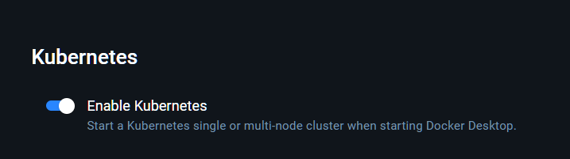
- then run `kubectl get service`
- 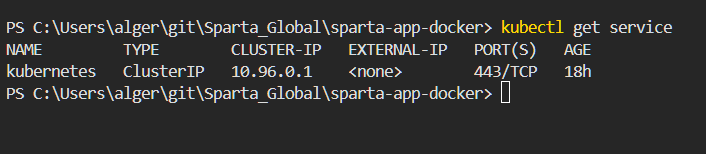

## Task: Create Nginx deployment only 
- made yaml file
```yaml
apiVersion: apps/v1
kind: Deployment
metadata:
  name: nginx-deployment
  labels:
    app: nginx
spec:
  replicas: 3
  selector:
    matchLabels:
      app: nginx
  template:
    metadata:
      labels:
        app: nginx
    spec:
      containers:
      - name: nginx
        image: daraymonsta/nginx-257:dreamteam
        ports:
        - containerPort: 80
```
- ran `kubectl apply -f nginx-deploy.yml`
- 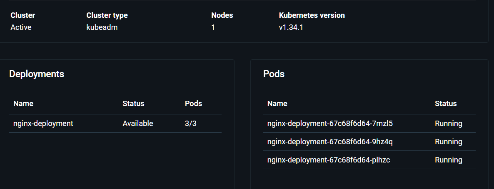
```
kubectl get all
NAME                                    READY   STATUS    RESTARTS   AGE
pod/nginx-deployment-67c68f6d64-7mzl5   1/1     Running   0          4m28s
pod/nginx-deployment-67c68f6d64-9hz4q   1/1     Running   0          4m28s
pod/nginx-deployment-67c68f6d64-plhzc   1/1     Running   0          4m28s

NAME                 TYPE        CLUSTER-IP   EXTERNAL-IP   PORT(S)   AGE
service/kubernetes   ClusterIP   10.96.0.1    <none>        443/TCP   18h

NAME                               READY   UP-TO-DATE   AVAILABLE   AGE
deployment.apps/nginx-deployment   3/3     3            3           4m28s

NAME                                          DESIRED   CURRENT   READY   AGE
replicaset.apps/nginx-deployment-67c68f6d64   3         3         3       4m28s
```

- 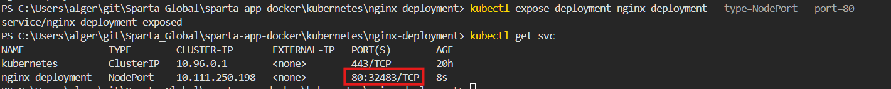
- 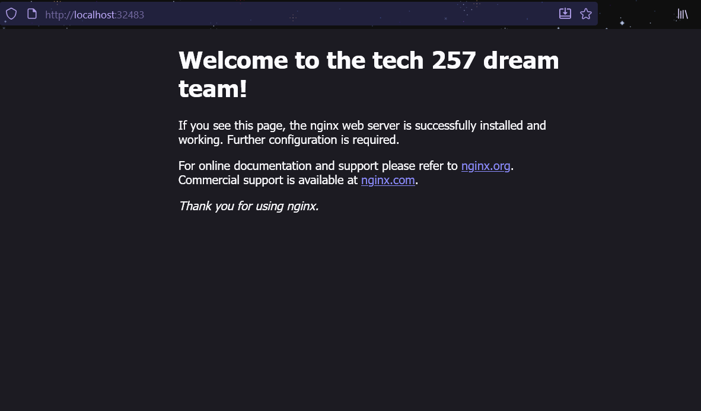


### Commands used:
```bash
kubectl apply -f nginx-deploy.yml
kubectl get deployment nginx-deployment
kubectl get rs
kubectl get pods
kubectl get all
```
- Deployment alone does **not** expose the app externally.
- ClusterIP is internal-only.
- Use `kubectl port-forward` or expose via a service to access in browser.

### Access Notes
- Visit `http://localhost:30001` in your browser.
- If not accessible:
  - Check pod status: `kubectl get pods`
  - Confirm port availability
  - Use node IP: `kubectl get nodes -o wide`


## Task: Get NodePort service running:
- Made a yaml file for creating a service `nginx-service.yml`
```yaml
apiVersion: v1
kind: Service
metadata:
  name: nginx-svc
spec:
  type: NodePort
  selector:
    app: nginx
  ports:
    - port: 80
      targetPort: 80
      nodePort: 30001
```

### Commands
```bash
kubectl apply -f nginx-service.yml
kubectl get svc nginx-svc
kubectl get svc
```

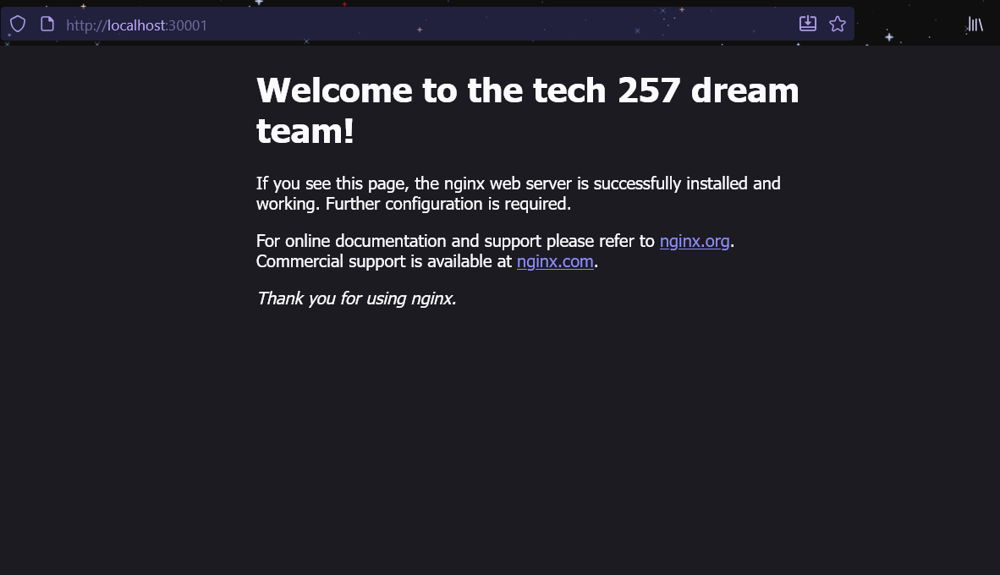

### Task: See what happens when we delete a pod 
- 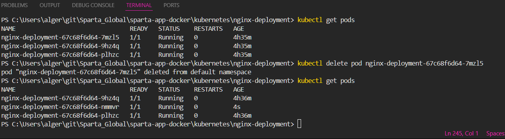
- Kubernetes automatically creates a new pod to maintain the desired replica count
- can get the information by `describe pod nginx-deployment-67c68f6d64-nmmvr`
```bash
Name:             nginx-deployment-67c68f6d64-nmmvr
Namespace:        default
Priority:         0
Service Account:  default
Node:             docker-desktop/192.168.65.3
Start Time:       Thu, 30 Oct 2025 15:21:19 +0000
Labels:           app=nginx
                  pod-template-hash=67c68f6d64
Annotations:      <none>
Status:           Running
IP:               10.1.0.17
IPs:
  IP:           10.1.0.17
Controlled By:  ReplicaSet/nginx-deployment-67c68f6d64
Containers:
  nginx:
    Container ID:   docker://2e956a8ae1413a64476ab9e8815ca221362661c2c39c5b3b22e83fc6d8ffe823
    Image:          daraymonsta/nginx-257:dreamteam
    Image ID:       docker-pullable://daraymonsta/nginx-257@sha256:aca9f1774d81786850052224e68a247259ec8d1790d14694aea373feaf57c03f
    Port:           80/TCP
    Host Port:      0/TCP
    State:          Running
      Started:      Thu, 30 Oct 2025 15:21:21 +0000
    Ready:          True
    Restart Count:  0
    Environment:    <none>
    Mounts:
      /var/run/secrets/kubernetes.io/serviceaccount from kube-api-access-9v2kx (ro)
Conditions:
  Type                        Status
  PodReadyToStartContainers   True
  Initialized                 True
  Ready                       True
  ContainersReady             True
  PodScheduled                True
Volumes:
  kube-api-access-9v2kx:
    Type:                    Projected (a volume that contains injected data from multiple sources)
    TokenExpirationSeconds:  3607
    ConfigMapName:           kube-root-ca.crt
    Optional:                false
    DownwardAPI:             true
QoS Class:                   BestEffort
Node-Selectors:              <none>
Tolerations:                 node.kubernetes.io/not-ready:NoExecute op=Exists for 300s
                             node.kubernetes.io/unreachable:NoExecute op=Exists for 300s
Events:
  Type    Reason     Age   From               Message
  ----    ------     ----  ----               -------
  Normal  Scheduled  33m   default-scheduler  Successfully assigned default/nginx-deployment-67c68f6d64-nmmvr to docker-desktop
  Normal  Pulled     33m   kubelet            Container image "daraymonsta/nginx-257:dreamteam" already present on machine
  Normal  Created    33m   kubelet            Created container: nginx
  Normal  Started    33m   kubelet            Started container nginx
```
- deployments are handled to maintain desired state in yaml file.

## Task: Increase replicas with no downtime 
- one way is editing the deployment file: `kubectl edit deployment nginx-deployment`
  - editied desired states from 3 to 4
  - now updated on docker desktop:
  - 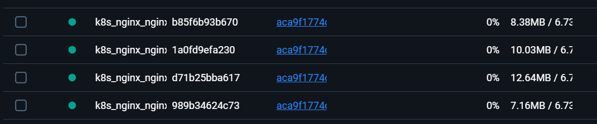
- another method is actively changing the yaml file 
  - changed number of active containers from 4 to 5
  - then ran `kubectl apply -f nginx-deploy.yml` to apply changes
  - proof:
  - 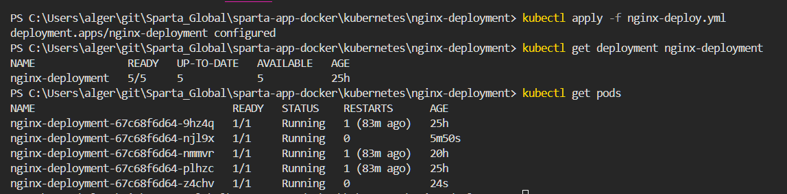
- final method: `kubectl scale deployment nginx-deployment --replicas=6`
  - 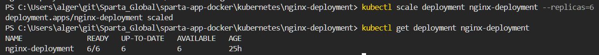
  
## Task: Delete K8s deployments and services 
```bash
kubectl delete -f C:/Users/alger/git/Sparta_Global/sparta-app-docker/kubernetes/nginx-deployment/nginx-deploy.yml
kubectl delete -f C:/Users/alger/git/Sparta_Global/sparta-app-docker/kubernetes/nginx-deployment/nginx-service.yml
```
- checked deletion with:
```bash
kubectl get deployment
kubectl get svc
kubectl get rs
kubectl get pods
```
- confirmation:
- 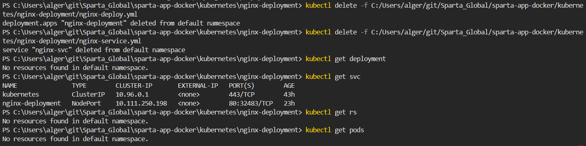

## Task: K8s deployment of NodeJS Sparta test app

+-----------------------------+ 
|     NodePort Service       |  <-- Exposes app on port 30002
|     (nodejs20-svc)         |
+-------------+--------------+
              |
      +-------▼--------+
      |  Deployment     |
      |  nodejs20-app   |  <-- 3 replicas
      +-------+--------+
              |
      +-------▼--------+
      |  Pod(s)         |
      |  nodejs app     |
      +-----------------+

(Optional in Phase 2)
+-----------------------------+
|     ClusterIP Service       |  <-- Internal access only
|     (mongo-svc)             |
+-------------+--------------+
              |
      +-------▼--------+
      |  Deployment     |
      |  mongo-db       |  <-- 1 replica
      +-----------------+

- Copy the YAML files nginx-deploy.yml and nginx-service.yml to a new subfolder named local-nodejs20-app-deploy (inside of the k8-yaml-definitions folder) for this deployment, but change the file names, label/tags, images used, ports
- cd'd into folder and opened terminal, ran following code:
```bash
kubectl apply -f nodejs20-service.yml
kubectl apply -f nodejs20-deploy.yml
```
- [working sparta app on local host node 30003](image.png)

- then to add mongodb, made two new files, mongo deploy (with mongo 7.0) and mongo service
- made sure for mongodb file to add `args: ["--bind_ip_all"]`

- to nodejs20-deploy.yml, added:

```yaml
env:
        - name: DB_HOST
          value: "mongo-svc"
```
- then ran 
```bash
kubectl apply -f mongo-deploy.yml
kubectl apply -f mongo-service.yml
kubectl apply -f nodejs20-deploy.yml
```
- 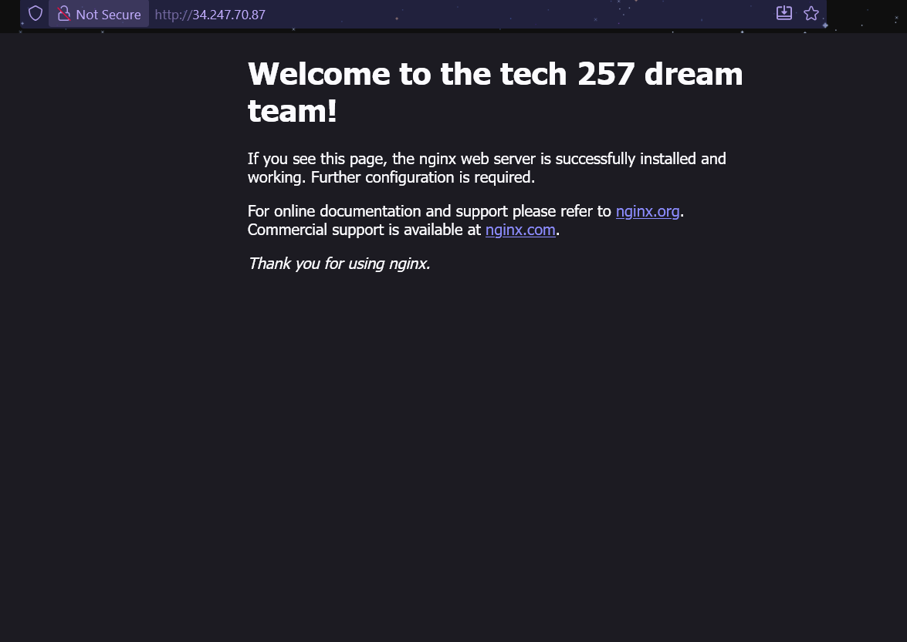
- useful commands I used for debugging:
```bash
kubectl get all
kubectl delete all --all
```